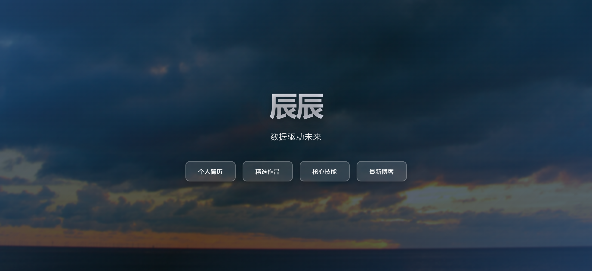

# 个人导航页模板

一个简洁优雅的个人导航页模板，采用现代玻璃态设计风格，支持响应式布局。

## 预览



## 特性

- 动态滚动背景
- 玻璃态按钮效果
- 流畅的动画过渡
- 完全响应式设计

## 特性

✨ **现代设计**
- 玻璃态（Glassmorphism）UI 设计
- 渐变文字效果
- 柔和的阴影和模糊效果

🎬 **动画效果**
- 背景图片无缝滚动动画
- 元素淡入向上动画
- 按钮悬停和点击效果

📱 **响应式布局**
- 支持桌面端、平板和移动设备
- 自适应字体大小
- 灵活的导航按钮布局

🎨 **易于定制**
- 纯 HTML + CSS 实现
- 无需 JavaScript 依赖
- 所有样式内联，便于修改

## 文件结构

```
shangchuan/
├── index.html              # 主页面文件
├── bj.jpg                  # 背景图片
└── 1.png                   # 预览截图
```

## 快速开始
1. **替换背景图片**
   - 将你的背景图片替换到 `bj.jpg`
   - 建议使用横向宽幅图片以获得最佳滚动效果

2. **修改内容**
   打开 `index.html`，修改以下内容：
   - 第 4 行：修改页面标题
   - 第 242 行：修改主标题文字
   - 第 243 行：修改副标题文字
   - 第 246-249 行：修改导航按钮文字和链接

3. **本地预览**
   - 直接用浏览器打开 `index.html` 文件
   - 或使用本地服务器（推荐）

## 自定义指南

### 修改颜色主题

在 `<style>` 标签中修改以下变量：

```css
/* 主背景色 */
body {
    background: #1a365d;  /* 修改为你喜欢的颜色 */
}

/* 按钮背景和边框 */
#header nav span {
    background: rgba(255, 255, 255, 0.12);
    border: 2px solid rgba(255, 255, 255, 0.25);
}
```

### 修改动画速度

```css
/* 背景滚动速度 */
#bj {
    animation: scrollRightToLeft 35s linear infinite;  /* 修改 35s 为其他值 */
}
```

### 添加或删除导航按钮

在 `<nav>` 标签内添加或删除 `<li>` 项：

```html
<li><span title="按钮提示">按钮文字</span></li>
```

### 启用链接功能

如果需要恢复链接功能，将 `<span>` 标签改回 `<a>` 标签：

```html
<!-- 当前（无链接） -->
<li><span title="提示">文字</span></li>

<!-- 改为（有链接） -->
<li><a href="your-link.html" title="提示">文字</a></li>
```

同时需要将 CSS 中的 `#header nav span` 改回 `#header nav a`。


⭐ 如果这个项目对你有帮助，欢迎给个 Star！
